## Auteure : 
Cassiopée Gossin <br> 
M1 CMI Informatique 

# MULTIVARIATE STATISTICAL ANALYSIS
Dans ce projet, on va utiliser les donnée de la base de donnée iris pour faire de l'analyse statistique multivariée. <br> 
Le but de ce projet est de faire des prédictions sur cette base de donnée à partir d'un arbre de classification. On va donc faire de l'apprentissage supervisé sur ces données, et ensuite on va évaluer les performances de nos prédictions avec un calcul de performance et une matrice de confusion. 

## Les données : 
Pour commencer, pour travailler sur des données on va importer ces données. <br>
Pour cela on va les importer en utilisant la librairie sklearn et on va les afficher avec la fonction visualizeIris que l'on a crée. Cette fonction renvoie le graphique suivant : <br> 
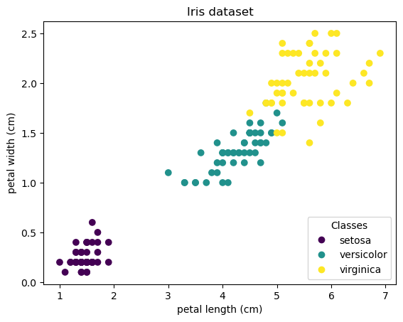 <br>
Sur ce graphique, on peut voir toutes nos données avec une légende où on peut constater que nos données sont répartis en 3 classes : setosa (violet), versicolor (vert), ou virginica (jaune). 

## Spliting values : 
Puis, pour construire l'arbre de classification, on veut pouvoir séparer les objets de notre database. Cette séparation nous servira par la suite à savoir quelle donnée va dans quelle branche de l'arbre à sa construction, puis cela sera utile pour prédire la bonne classe d'une observation suivant là où les données sont séparées. <br><br>
Pour séparer nos valeurs, on va chercher la meilleure séparation qu'il existe dans nos données (la fonction best_split). Pour cela on va effectuer pleins de séparations dans nos données et à chacune d'entre elles on va calculer le Gini de cette séparation. Le Gini sert à savoir quel est la pureté de la séparation. Plus le Gini est petit, plus la séparation est pure. <br><br>
On calcule le Gini d'une séparation avec la fonction gini_of_split et on crée la séparation de nos données avec la fonction split qui va simplement créer deux tableaux avec dans chaque tableau les données séparées suivant une valeur précise sur une variable précise de cette base de donnée. <br><br>
De plus on remarque que l'on va aussi séparer le 'target set' qui est un tableau qui permet de savoir dans quelle classe se trouve chaque élément de notre jeu de donnée. On va garder avec nous ce targetset pour pouvoir comparer et calculer la Gini de nos objets. <br><br>
Pour effectuer pleins de spérarations dans nos données, on va, pour chaque variable de nos données, faire 50 coupures dans nos données (toutes de part égales). Le nombre 50 est un nombre arbitraire qu'on a choisi pour effectuer assez de séparations sans que cela impacte trop les performances de l'algorithme. Et donc, comme dit précédemment, on va calculer le Gini de chacune des séparations et on va stocker la séparation qui permet d'avoir le plus petit Gini parmis tous. C'est cette séparation en particulier que l'on considère comme la meilleure séparation possible de nos données et c'est elle que l'on va choisir pour découper notre database et créer l'arbre. <br><br>
Sur notre database iris complète, la meilleure séparation des données est la suivante : <br>
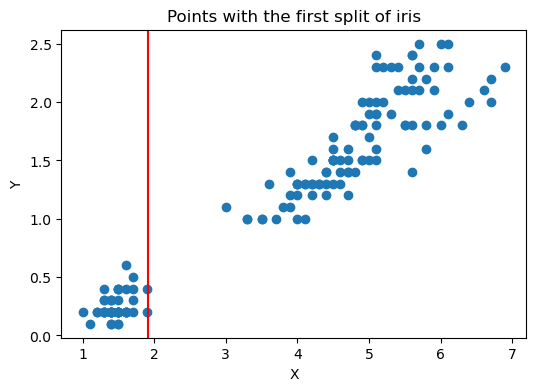 <br>
Sur ce graphique, on peut constater que la meilleure séparation se trouve sur la variable 'pertal_length' et se trouve à environ 1.9. 

## Classification tree : 
Maintenant que l'on sait comment séparer notre jeu de donnée de la meilleure manière possible, on peut créer notre arbre de classification. <br> 
Pour cela on va créer une classe Node qui représente les noeuds de norte arbre, on va également créer les fonctions fit et make_a_tree qui permettent de créer le premier noeud de l'arbre et de créer ensuite le reste de l'arbre avec un appel à la fonction récursive. <br><br>
Dans notre arbre, on va stocker à chaque noeud son dataset (ses données), son targetset (les calsses associées à ces données), les fils gauche et fils droit, la pureté du noeud (calculé avec Gini), la variable à laquelle la séparation a été faire (cutting variable), la valeur à laquelle la séparation à été faite (cutting value), la profondeur, et le nombre d'individus présents dans ce noeud. <br><br>
Le nombre d'individus et la profondeur vont notamment nous permettre de faire en sorte d'arrêter la création de l'arbre quand une certaine profondeur est atteinte ou que le nombre d'individus présent dans le noeud devient trop petit. Ici on a choisi d'arrêté la création de l'arbre si la profondeur dépasse 30 ou si le nombre d'individus est en dessous de 5. <br><br>
de plus, lors de la création de cet arbre, on va donc calculer à chaque noeud la meilleure séparation possible, et mettre à gauche les données qui sont plus petite à la cutting variable à la cutting value, et à droite les autres (donc celles qui sont plus grandes). <br><br>
Puis, pour avoir plus de visualisation sur l'arbre que l'on vient de créer, on va créer une fonction feature_importance qui permet de compter le nombre de fois où une variable est utilisée pour construire nos données. Pour cette fonction, on va simplement parcourir l'arbre et compter le nombre de fois où une variable est utilisée. Le résultat est le suivant : <br>
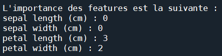 <br>
Ici, on peut constater que les variable sepal lenght et sepal width ne sont pas du tout utilisées. Et donc à l'inverse, on remarque que les variables petal lenght et petal width sont utilisées respectivement 3 et 2 fois. On va donc choisir d'afficher nos données à partir de ces variables là pour avoir la meilleure visualisation possible de nos données et de ce qu'il se passe pour les prédictions. 

## Predict : 
Maintenant que l'on a un arbre de classification, on veut pouvoir prédire la classe de nouvelles observations et vérifier si elles sont justes. <br><br>
Pour cela, on va créer la fonction predict qui permet de prédire la classe d'une observation. Pour prédire une observation, on va tout d'abord créer l'arbre avec la fonction fit, puis on va parcourir l'arbre avec la fonction travelTree pour savoir, en fonction des valeurs de l'aobservation, de la classe la plus probable pour cette observation. <br><br>
La fonction travelTree a une particularité. En effet, si on le souhaite, on peut mettre la variable printPath à True pour pouvoir avoir un visual sur le chemin que prend l'observation dans l'arbre et ainsi mieux comprendre les choix qui ont mené l'algorithme à choisir cette classe pour cette observation. <br><br>

## Examples for predictions : 
Voici une liste d'exemples sur notre algorithme de prédiction. 
### 1 :
L'observation est la suivante : <br>
```
obs1 = [4.6, 3.1, 1.5, 0.2]
```
Le chemin de cette observation dans l'arbre est le suivant : <br>
```
L observation a une petal length (cm) plus petite que celle du noeud : 1.5 <= 1.9100000000000006, donc on va dans le fils gauche
L observation est arrivée dans la classe setosa
Classe prédite pour [4.6, 3.1, 1.5, 0.2] est : setosa
```
Le graphique résultant avec la prédiction (en rouge) est le suivant : <br>
 <br>
Avec ces informations, on peut constater que l'observation a été bien prédi (classe setosa), et donc que notre arbre de classification marche très bien car une donnée en plein milieu d'une classe est bien prédite. 

### 2 :
L'observation est la suivante : <br>
```
obs2 = [6.8, 3.2, 5.9, 2.3]
```
Le chemin de cette observation dans l'arbre est le suivant : <br>
```
L observation a une petal length (cm) plus grande que celle du noeud : 5.9 > 1.9100000000000006, donc on va dans le fils droit
L observation a une petal width (cm) plus grande que celle du noeud : 2.3 > 1.7200000000000004, donc on va dans le fils droit
L observation a une petal length (cm) plus grande que celle du noeud : 5.9 > 4.864, donc on va dans le fils droit
L observation est arrivée dans la classe virginica
Classe prédite pour [6.8, 3.2, 5.9, 2.3] est : virginica
```
Le graphique résultant avec la prédiction (en rouge) est le suivant : <br>
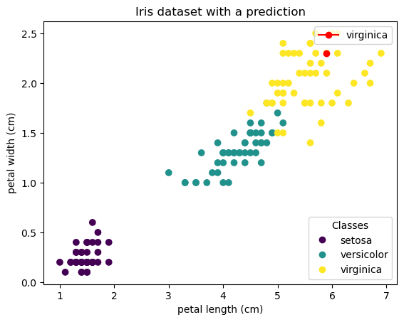 <br>
Avec ces informations, on peut constater que l'observation a été bien prédi (classe virginica), et donc que notre arbre de classification marche très bien car une donnée en plein milieu d'une classe est bien prédite. 

### 3 :
L'observation est la suivante : <br>
```
obs3 = [5.6, 2.5, 3.9, 1.1]
```
Le chemin de cette observation dans l'arbre est le suivant : <br>
```
L observation a une petal length (cm) plus grande que celle du noeud : 3.9 > 1.9100000000000006, donc on va dans le fils droit
L observation a une petal width (cm) plus petite que celle du noeud : 1.1 <= 1.7200000000000004, donc on va dans le fils gauche
L observation a une petal length (cm) plus petite que celle du noeud : 3.9 <= 4.9559999999999995, donc on va dans le fils gauche
L observation est arrivée dans la classe versicolor
Classe prédite pour [5.6, 2.5, 3.9, 1.1] est : versicolor
```
Le graphique résultant avec la prédiction (en rouge) est le suivant : <br>
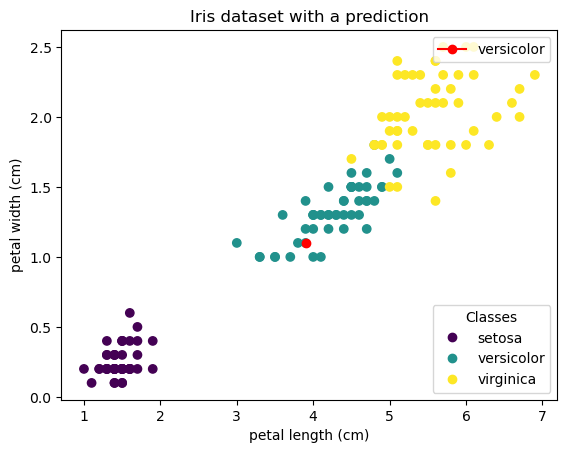 <br>
Avec ces informations, on peut constater que l'observation a été bien prédi (classe versicolor), et donc que notre arbre de classification marche très bien car une donnée en plein milieu d'une classe est bien prédite. 

### 4 :
L'observation est la suivante : <br>
```
obs4 = [4.6, 3.2, 3.9, 1.8]
```
Le chemin de cette observation dans l'arbre est le suivant : <br>
```
L observation a une petal length (cm) plus grande que celle du noeud : 3.9 > 1.9100000000000006, donc on va dans le fils droit
L observation a une petal width (cm) plus grande que celle du noeud : 1.8 > 1.7200000000000004, donc on va dans le fils droit
L observation a une petal length (cm) plus petite que celle du noeud : 3.9 <= 4.864, donc on va dans le fils gauche
L observation est arrivée dans la classe virginica
Classe prédite pour [4.6, 3.2, 3.9, 1.8] est : virginica
```
Le graphique résultant avec la prédiction (en rouge) est le suivant : <br>
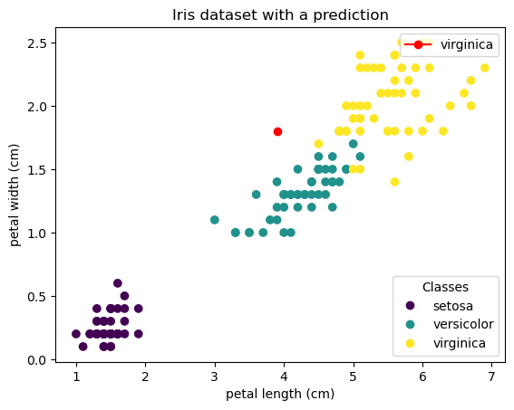 <br>
Avec ces informations, on peut constater que l'observation a été prédi comme étant de la classe virginica. Cette observation est un peu ambigue car elle aurait pu appartenir à la classe virginica comme à la classe versicolor. Notre algorithme à toute fois bien prédi cette observation donc norte arbre de classification fonctionne bien. 

### 5 :
L'observation est la suivante : <br>
```
obs5 = [4.6, 3.2, 1.9, 1.8]
```
Le chemin de cette observation dans l'arbre est le suivant : <br>
```
L observation a une petal length (cm) plus petite que celle du noeud : 1.9 <= 1.9100000000000006, donc on va dans le fils gauche
L observation est arrivée dans la classe setosa
Classe prédite pour [4.6, 3.2, 1.9, 1.8] est : setosa
```
Le graphique résultant avec la prédiction (en rouge) est le suivant : <br>
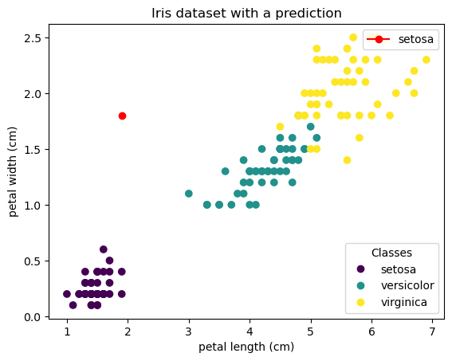 <br>
Avec ces informations, on peut constater que l'observation a été prédi comme étant de la classe setosa. Cette observation est ambigue car elle est assez éloignée de toutes les autres données. Et selon notre abre et selon notamment la première séparation des données présente dans notre arbre, la classe la plus probable est la classe setosa. Notre arbre fonctionne donc bien car il a bien prédit. 

## Train/test split : 
Maintenant que l'on sait que notre arbre de classficiation fonctionne et que l'on peut faire des prédictions avec cet abre, on veut calculer ses performances. Pour cela, on va diviser nos données pour avoir une base d'entrainement et une base de test. La base d'entrainement va être utilisée pour entrainer le modèle (elle représente en général 70% des données), et la base de test va être utilisée pour tester le modèle et notamment savoir si il fonctionne bien (elle représente en général 30% des données). <br><br>
Pour créer les bases d'entrainement et de test, on va tout d'abord mélanger les données aléatoirement pour être sûr que la base de test et d'entrainement n'ont pas des données trop éloignées. Pour cela, on va créer la fonction blend qui permet justement de mélanger aléatoirement le dataset et le targetset et de renvoyer les deux tableaux mélangés. <br><br>
Ensuite, on veut séparer nos données. Pour cela, on va simplement créer une fonction (separateData) qui permet de couper nos données de tel sorte à avoir 70% de notre base pour entrainer le modèle et 30% pour tester le modèle (sachant que la fonction est construite de tel sorte à pouvoir mettre n'importe quel pourcentage en paramètre pour la base d'entrainement et de test, on peut donc modifier ces pourcentages à notre guise). <br><br>
Puis, on va calculer la performance de notre algorithme. Pour cela on crée la fonction performance qui va calculer le nombre d'indivudus mal classés dans notre base de test et retourner ce nombre en pourcentage, on a donc un pourcentage d'erreur. Dans cette fonction on va donc simplement prédire la classe d'un élément de la base de test, et ensuite vérifier si oui ou non cet élément a été bien classé ou non. <br><br>
De plus, cette fonction perfromance permet aussi d'afficher la matrice de confusion de cette base de test. La matrice e confusion permet d'avoir un visuel concis et précis sur les éléments bien classés et mal classés par notre algorithme. <br>

## Example for accuracy : 
On obtient l'affichage suivant : <br>
```
Le pourcentage d erreur est de 2.2222222222222223%
Le matrice de confusion est la suivante :
[[10.  0.  0.]
 [ 0. 17.  0.]
 [ 0.  1. 17.]]
```
On obtient également la matrice de confustion suivante (avec un meilleur affichage) : <br>
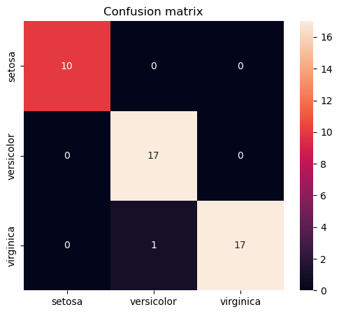 <br>
On peut observer que sur ce calcul de perfromance, notre algorthme est très efficace. En effet, on n'a que 2.22% d'erreur ce qui est très bas. De plus on peut constater sur la matrice de confusion que notre algorithme ne s'est trompé qu'une seule fois. 

## Cross-validation
A présent, maintenant que l'on peut calculer et visualiser la performance de notre algorithme, on veut faire de la cross-validation. Cette méthode consiste à faire plusieurs validations et calculs de performances de notre algorithme en découpant notre database de tel sorte à ne jamais avoir la même base de test. Pour cela, on va faire un premier calcul de perfromance sur un premier découpage. Puis quand cela est fait, on va mettre la base de test tout au dessus des données pour que le découpage des données laisse les premières données de tets dans la base d'apprentissage. Puis on réitère jusqu'a avoir fait des tests sur l'entièreté de la database. On va donc créer la fonction crossValidation qui permet justement de faire cette cross-validation. 

## Examples for cross-validation : 
Voici des exemples pour la cross-validation, ces exemples apparaissent pour un seul lancé de la cross-validation avec un pourcentage de 70% pour la base d'entrainement et de 30% pour la base de test. 

### Premier tour : 
On obtient l'affichage suivant : <br>
```
Le pourcentage d erreur est de 8.88888888888889%
Le matrice de confusion est la suivante :
[[16.  0.  0.]
 [ 0.  9.  1.]
 [ 0.  3. 16.]]
```
On obtient également la matrice de confustion suivante (avec un meilleur affichage) : <br>
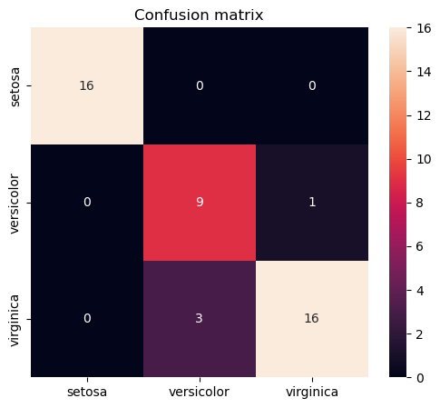 <br>
On peut observer que sur ce premier calcul de perfromance, notre algorthme est plutot efficace. En effet, on n'a que 8.88% d'erreur ce qui est assez bas, même si ce n'est pas parfait. De plus on peut constater sur la matrice de confusion que notre algorithme s'est trompé 4 fois, ce qui peut être considérer comme étant pas trop d'erreur. 

### Deuxième tour : 
On obtient l'affichage suivant : <br>
```
Le pourcentage d erreur est de 4.444444444444445%
Le matrice de confusion est la suivante :
[[17.  0.  0.]
 [ 0. 14.  2.]
 [ 0.  0. 12.]]
```
On obtient également la matrice de confustion suivante (avec un meilleur affichage) : <br>
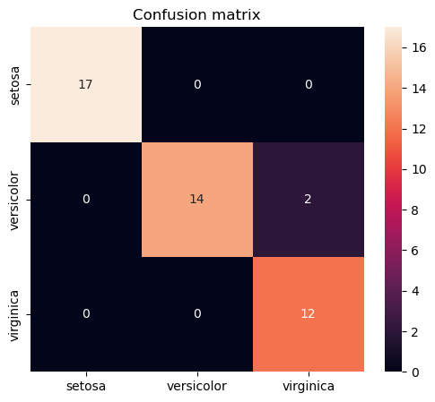 <br>
On peut observer que sur ce deuxième calcul de perfromance, notre algorthme est très efficace. En effet, on n'a que 4.44% d'erreur ce qui est bas. De plus on peut constater sur la matrice de confusion que notre algorithme ne s'est trompé que deux fois. 

### Troisième tour : 
On obtient l'affichage suivant : <br>
```
Le pourcentage d erreur est de 4.444444444444445%
Le matrice de confusion est la suivante :
[[11.  0.  0.]
 [ 0. 17.  2.]
 [ 0.  0. 15.]]
```
On obtient également la matrice de confustion suivante (avec un meilleur affichage) : <br>
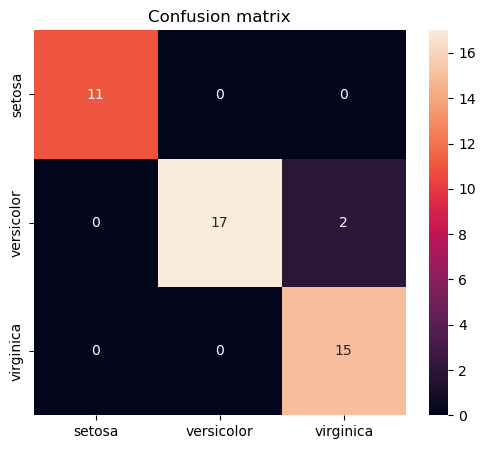 <br>
On peut observer que sur ce troisième calcul de perfromance, notre algorthme est très efficace. En effet, on n'a que 4.44% d'erreur ce qui est bas. De plus on peut constater sur la matrice de confusion que notre algorithme ne s'est trompé que deux fois. 

### Total des tours : 
On obtient l'affichage suivant : 
```
La moyenne des performance du modèle est la suivante : 5.9259259259259265%
```
On peut constater sur nos matrices de confusion que notre algorithme à un peu du mal à chaque fois à bien séparer versicolor et virginica, ce qui est logique car ces deux classes sont très proches et ont des caractériqtiques similaires poru certains des indicidus. <br>
De plus, on peut constater que la moyenne des performances de la cross validation est environ de 5.92%, ce qui est assez bas. On peut donc en déduire que notre algorithme est performant. <br>
De plus, il faut savoir que ces matrices de confusion sont faites à partir du mélage aléatoire des données faites dans la fonction blend, je vous invite donc à tester vous même le code pour avoir d'autres visualisations de ces matrices et d'autre calculs de performances de l'arbre de classification.

## Conclusion :
Pour conclure, on a fait de l'analyse statistiques multivariée sur la datasbase iris en séparent des données suivant la meilleure variable et la meilleure valeur possible. On a crée un arbre de classification et on a fait des prédictions de classes à partir de cet arbre pour certaines observations. Et enfin on a calculé la performance de notre algorithme de prédiction en calculant le nombre d'éléments mal classés et en affichant la matrice de confusion. 
